**Lab 5: Investigating Microsoft Defender for Endpoint Generated Real-Time Alerts in Microsoft Sentinel**

## Introduction

Microsoft Sentinel's Microsoft Defender XDR incident integration allows
you to stream all Microsoft Defender XDR incidents into Microsoft
Sentinel and keep them synchronized between both portals. Incidents from
Microsoft Defender XDR include all associated alerts, entities, and
relevant information, providing you with enough context to perform
triage and preliminary investigation in Microsoft Sentinel. Once in
Sentinel, incidents will remain bi-directionally synced with Microsoft
Defender XDR, allowing you to take advantage of the benefits of both
portals in your incident investigation using Microsoft Copilot for
Security.

## Objectives

- To create a workspace and activate Microsoft Sentinel free trial

- To install and configure Microsoft Defender for Endpoint and Microsoft
  Defender XDR in Microsoft Sentinel.

- To connect Microsoft Sentinel Workspace with Microsoft Defender for
  enhanced security monitoring.

- To generate Real-Time Alerts in Microsoft Sentinel

- To identify and review alerts generated by Microsoft Defender for
  Endpoint using Kusto Query Language.

- To analyze and review real-time alerts and incidents in Microsoft
  Sentinel for threat management.

- To add Indicator of Compromise (IoC) to Threat Intelligence for
  enhanced security monitoring and response.

**Task 1: Creating a workspace and activating Microsoft Sentinel free trial**

1.  In the Azure portal search box, type +++**Microsoft Sentinel**+++, then
    navigate down to **Services** section and click on **Microsoft
    Sentinel** from the list.

> 

2.  In Microsoft Sentinel page, click on **+Create**.

> 

3.  In **Add Microsoft Sentinel to a workspace** page, click on **+**
    **Create a new workspace**.

> 

4.  In **Create Log Analytics workspace** page, enter the following
    details, then click on **Review and create** button.

| Setting | Description/Selection |
|:---------|:---------|
| **Subscription**   | Select the assigned **Azure Pass -- Sponsorship**.|
| **Resource Group** | Select the resource group that you've created previously (**MCS-RG**) |
| **Name** | Mylogworkspace+SUFFIX (here, we entered **mylogworkspace5801**)|
| **Region** | Southeast Asia |

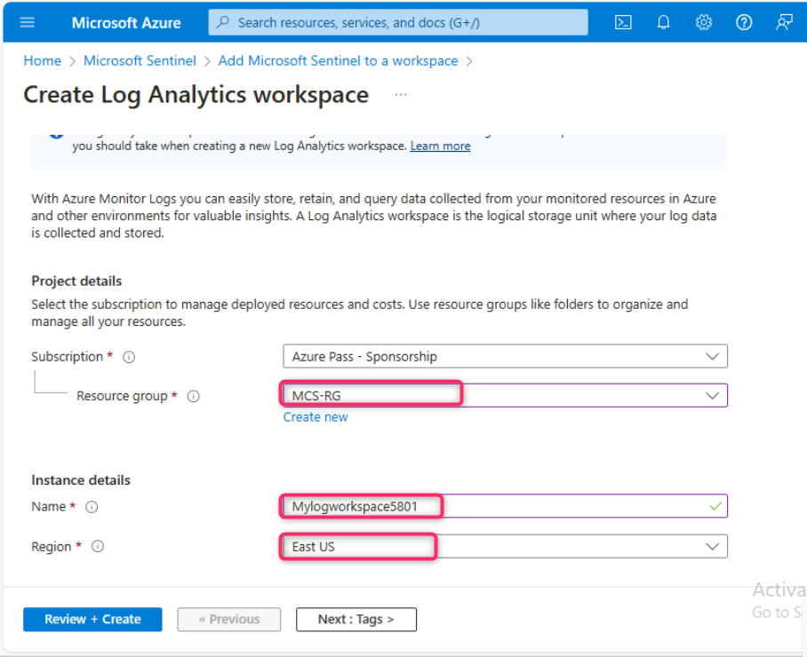

5.  In **Create Log Analytics workspace** page, after Validation passed,
    click on the **Create** button.

6.  After few minutes, the workspace will be successfully created.

> [!Note]: In case, you did not see the workspace, then refresh the page.

7.  Select the workspace, then click on the **Add** button.

8.  On Microsoft Sentinel free trial activated dialog box, click on the
    **OK** button.

**Task 2: Connecting Microsoft Dender for Endpoint and Microsoft
Defender XDR data connectors to Sentinel for enhancing security
capabilities**

1.  Navigate and click on **Content management**, then select **Content
    hub**.

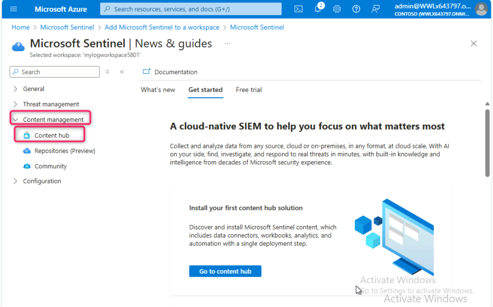

2.  In the **Content hub** search bar, type +++**defender for endpoint**+++
    and press the enter button.

> 

3.  Scroll down and select **Microsoft Defender for Endpoint**, then
    select the **Install** button on the right-sided pane.

> 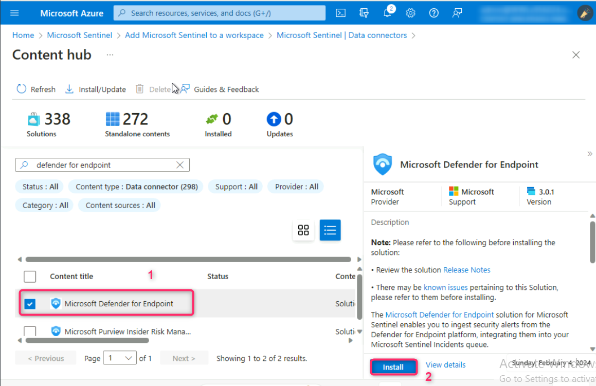

4.  After the installation is successfully completed, select again
    **Microsoft Defender for Endpoint** and click on **Manage** button.

> 

5.  On **Microsoft Defender for Endpoint** page, navigate to **Content
    name** column, check the box beside **Microsoft Defender for
    Endpoint** as shown in the below image. Then, click on **Open
    connector** **page** button.

> 
>
> 

6.  Navigate to **Configuration** section and click on **Connect**
    button. You’ll received a notification – **Successfully connected
    Microsoft Defender for Endpoint alerts**.

> 
>
> 
>
> 

7.  Click on **Microsoft Sentinel | Content hub** link below the Azure
    search bar as shown in the below image. In the **Microsoft Sentinel
    | Content hub** page search bar, type +++**Microsoft Defender XDR**+++ and
    press the enter button. Scroll down and select **Microsoft Defender
    XDR**.

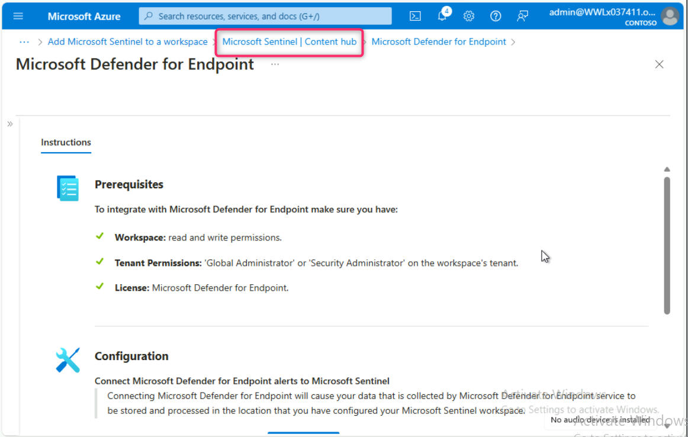

8.  In **Microsoft Defender XDR** pane that appears on the right side,
    navigate and click on **Install** button.

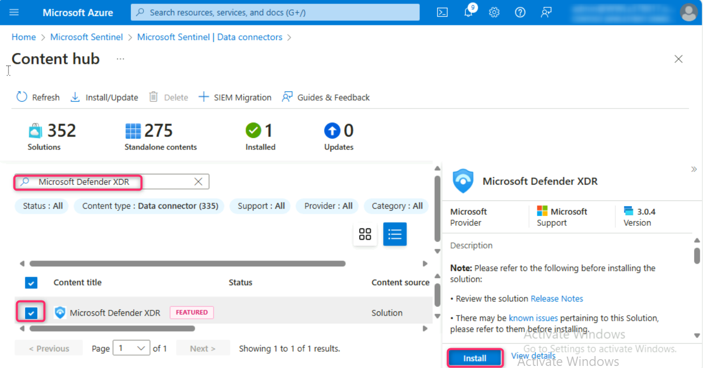

9.  After the installation is successfully completed, select again
    **Microsoft Defender XDR**, then click on the **Manage** button as
    shown in the below image.

> 

10. In **Microsoft Defender XDR** page, navigate and select the check
    box of **Microsoft Defender XDR**, then click on **Open connector
    page** button.

> 

11. Scroll down to **Configuration** section. Ensure to check the box of
    **Turn off all Microsoft incident creation rules for these
    products**, then click on the **Connect incidents & alerts** button.

> 
>
> 

12. Select all the Microsoft Defender XDR products except

- Microsoft Defender for Cloud Apps (0/1 connected)​

- Microsoft Defender for Identity (0/3 connected)​

Click on **Apply** **changes** button.

> 
>
> 
>
> 
>
> 

13. Go back to **Microsoft Defender** portal and **Sign out** from it.

**Task 3: Connecting Microsoft Sentinel Workspace with Microsoft Defender**

1.  Open a new address bar and enter the following link to open the
    Microsoft Defender Portal: +++**https://security.microsoft.com**+++

2.  Select your O365 tenant ID.

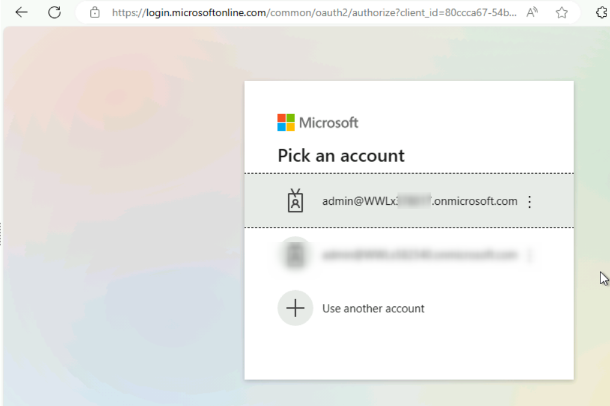

3.  Enter the password.

4.  In **Stay signed in?** window, click on the **Yes** button.

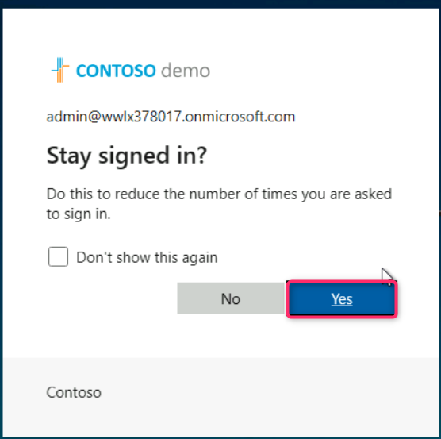

5.  In **Get your SIEM and XDR in one place** dialog box, click on
    **Connect a workspace** button.

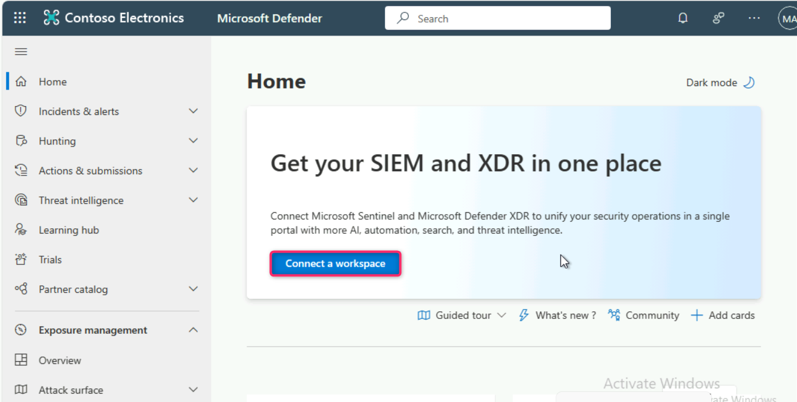

6.  Select **MylogworkspaceXXXX** workspace and click on the **Next**
    button.

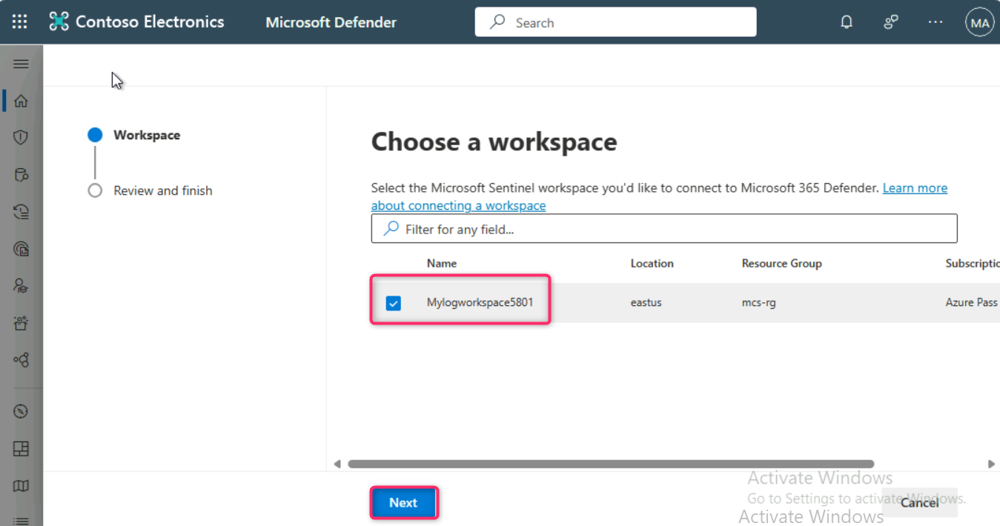

7.  In the **Review changes** page, click on the **Connect** button.

8.  Wait for few minutes for the workspace to be successfully connected
    to Microsoft 365 Defender. After workspace successfully connected,
    click on the **Close** button.

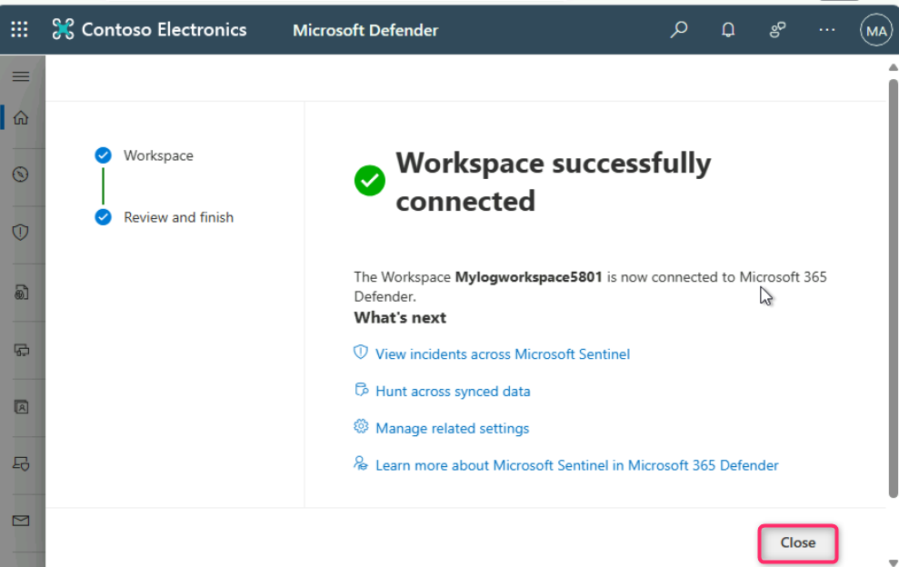

9. Go back to Azure portal. In the Azure portal search bar, type
    +++**Microsoft Sentinel**+++, then navigate and click on **Microsoft
    Sentinel** under **Services**.

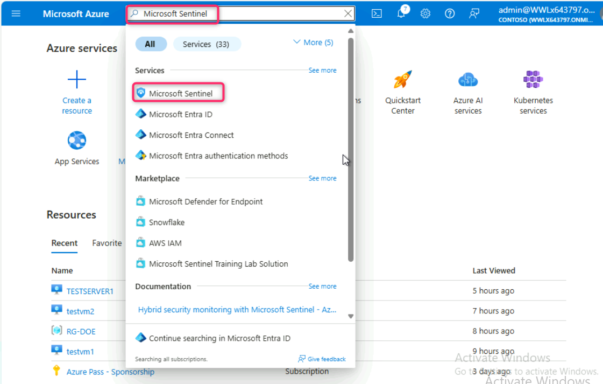

10. In the Microsoft Sentinel page, navigate and click on
    **MylogworkspaceXXXX** workspace.

11. Click on **Threat management** and then click on **Incidents**. You
    will observe that there are no **Open incidents**/**New incidents**.
    In the next task, we will create incidents again in the testvm1.

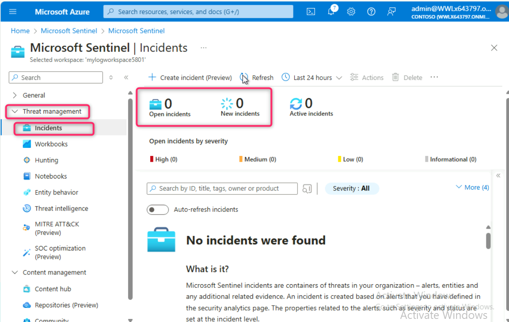

**Task 4: Generating Real-Time Alerts in Microsoft Sentinel**

**Important Note**: As you have already executed the malicious documents
and scripts in **testvm1**, Windows Security would blocked the execution
of some of the malicious documents and scripts; therefore, if any
documents or scripts are not successfully executed, then you can ignore
it and move on to the next step. The goal of this task is to generate
alerts and incident in Microsoft Sentinel.

> 1\. In the Azure portal search bar, type +++**virtual machine**+++,
> then navigate and click on **Virtual machines** under **Services**.

2. In the **Virtual machines** page, navigate and click on **testvm1**.
On **testvm1** Virtual machine page, click on the **Start** button.

3.  Wait for few minutes for the virtual machine to start, then navigate
    and click on **Connect** on the left side navigation menu, scroll
    down to **Native RDP** tile, and click on the **Download RDP file**.

4.  On **testvm1.rdp could harm your device. Do you want to keep it
    anyway?** dialog box, click on **Keep** button.

> 

5.  On **testvm1.rdp** file, click on **Open file** link.

> 

6.  On **The publisher of this remote connection can’t be identified. Do
    you want to connect anyway?** dialog box, click on **Connect**
    button.

> 

7.  On **Enter your credentials** dialog box, enter the password (here,
    **Administrator5801@\***) and click on the **OK** button.

8.  On **The identity of the remote computer cannot be verified. Do you
    want to connect anyway?** dialog box, click on **Yes** button.

  
11.  Navigate to **C:** folder. Delete the RanSim folder.
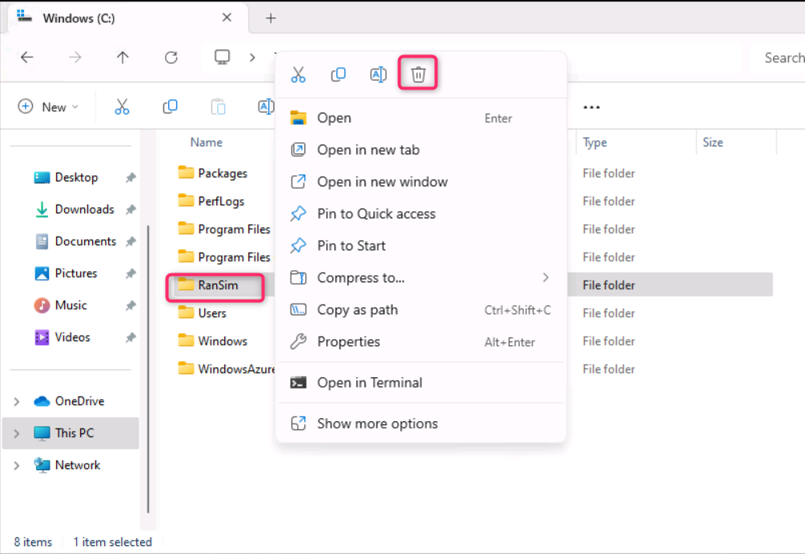

12. Now, navigate to **C:\Users\Admin5802\RanSim** folder, copy the RanSim folder, paste it into **C:** because Windows Security previously removed the executed RanSim PowerShell script.
    

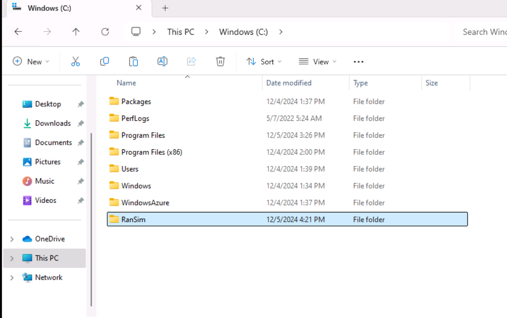
   
12. Open the RanSim folder. Click anywhere inside the folder, then right click and select **Open in terminal**.

9.  Navigate to **C:\Users\Admin5802\RanSim** folder. Click anywhere inside the folder, then right click and select **Open in terminal**.

10. In the command prompt, execute the following command to initiate a
    ransomware attack.

+++**.\RanSim.ps1 -Mode encrypt**+++

**Note**: The script may be successfully executed or it might be blocked
by Microsoft Antivirus. In both the scenarios, continue with the next
task, as our goal is to record the alerts generated during the attack.

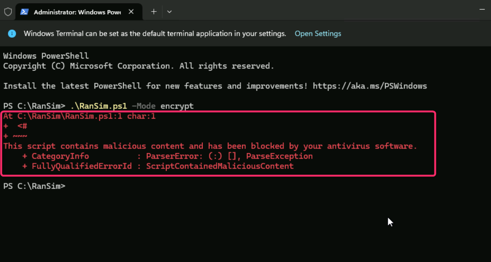

11. Navigate to **C:\Users\Admin5802**, then click on **examples**
    folder as shown in the below image.

12. You will see various malwares files and script.

**Note**: In case, you did not find any word file mentioned in the step, then ignore that step and move on to the next step, as Windows Security might have removed that particular malicious file.

13. Open **Block_Win32_imports_from_Macro_code_in_Office….** in word.

14. Click on **Enable Content** to execute the malware file.

15. Now, click on **RS4_WinATP-Intro-Invoice** and open the file in
    word.

**Note**: If this malware file is not successfully executed or Windows
security block the execution, then you can ignore it and move on to the
next steps.

16. You will be prompted to enter the password, provide the password as
    +++**WDATP!diy#**+++ and click on the **OK** button.

17. The file will open with a **SECURITY WARNING**, click on the
    **Enable content** button as shown in the below image.

18. You’ll be prompted about a demo attack, click on the **OK** button.

19. Now, navigate and open
    **TestFile_Block_Office_applications_from_creating_executable** in
    word as shown in the below image.

20. Click on **Enable content**, it will execute another ransomware
    attack in **testvm1**.

In case, **Microsoft Word Security Notice** dialog box appears, click on
the **OK** button.

21. Now, open **TestFile+OfficeChildProcess** file in word.

22. Click on **Enable Content**. If you see an error, the action was
    blocked. If you see cmd.exe launch, it was not blocked.

23. Right click inside the folder, then navigate and click on **Open in
    Terminal**.

24. Type +++**ls**+++ to get the list of the scripts in the folder.
    Then, execute the following script:

+++**./SQLDumper.exe**+++

25. Wait for **15-20 minutes** for the generated alerts to be ingested
    in Microsoft Sentinel.

**Task 5: Use Kusto Query Language to find alert details**

1.  Refresh the Microsoft Sentinel and Microsoft Defender page.

2.  In Microsoft Sentinel page, navigate to **General** section and
    click on **Logs**. **Queries** dialog box will appear, click on the
    **close** icon as shown in the below image.

**Note**: Microsoft Defender for Endpoint, formerly known as ‘Microsoft
Defender ATP’ (MDATP) or ‘Windows Defender ATP’ (WDATP).

3.  On **Microsoft Sentinel | Logs** page, run the following command to
    identify the alerts generated by Microsoft Defender for Endpoint.

+++**SecurityAlert | where ProviderName contains "MDATP"**+++

> 

4.  Click on any alert and review the details.

> 

5.  Delete the previously entered command. To see medium severity alerts
    generated by Defender for Endpoint, enter the following command:

SecurityAlert
| where ProviderName == "MDATP"
| where AlertSeverity == "Medium"

**Task 6: Analyzing the Real-Time Alerts in Microsoft Sentinel**

> 1\. In the left-sided navigation menu, under **Threat management**,
> click on **Incidents**.

2.  In the **Microsoft Sentinel | Incidents** page, select the incident,
    a right-sided pane will appear, scroll down, and click on **View
    full details** button.

3.  Under the **Overview** tab, review all the alert.

4.  Click on any alert (here, we clicked on **‘Filecoder’ ransomeware
    was detected**. Review the alert details that appear on the
    right-sided pane. Check the **Remediation steps** at the bottom of
    the pane.

**Task 7: Adding Indicator of Compromise (IoC) to Threat Intelligence**

1.  Now, click on the Entities tab as shown in the below image.

2.  Scroll down to any IP address and then click on the horizontal
    ellipsis in the IP address row. Navigate and select **Add to TI**.

3.  In the **New indicator** pane that appears on the right side, scroll
    down and enter **Valid from** and **Valid until** dates for the new
    indicator and click on the **Apply** button.

4.  You’ll see a message that the **Indicator** is successfully created.

**  
**

**Summary**

In this lab, you’ve learned to effectively deploy, configure, and
utilize Microsoft Defender for Endpoint to investigate and respond to
real-time security alerts. You’ve created a log analytics workspace and
activated a Microsoft Sentinel free trial, followed by connecting
Microsoft Defender for Endpoint and Microsoft Defender XDR data
connectors to bolster security capabilities. Utilizing Kusto Query
Language (KQL), you’ve identified and analyzed real-time alerts, gained
insights into threat detection and response. You’ve further honed your
skills by investigating and reviewing incident details within Microsoft
Sentinel, enabling you to assess and mitigate security risks promptly.
Additionally, you’ve expanded your understanding of proactive security
measures by adding an Indicator of Compromise (IoC) to Threat
Intelligence. Through this lab, you’ve developed essential competencies
in leveraging Microsoft Defender for Endpoint for effective threat
management and incident response in dynamic cybersecurity environments.
